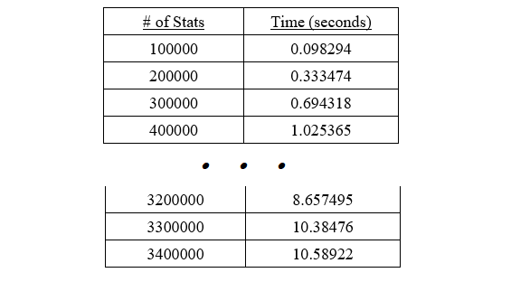
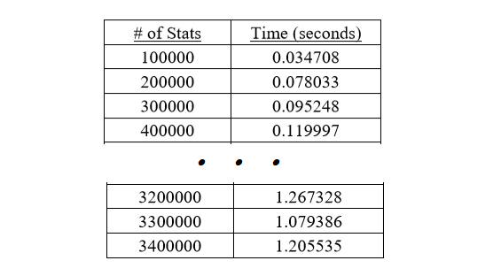
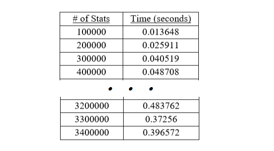

Implementation of three different map methods in Java with the fastest reading over 3 million data rows in under 0.4 seconds.

This project was completed as part of the Data Structures and Algorithms course. There were two main components to this project: analyzing a data structure to store the data and determining an algorithm to print the top 20 players.

The three types of data structures that were analyzed were an Unsorted List, a Binary Search Tree, and a Hash Table. These methods were analyzed through collecting empirical measurements and finding the worst-case growth rate from the code implementation. 

The algorithms analyzed for determining the top 20 players were Priority Queue, Balanced Binary Search Tree, Iteration, TreeMap with Comparator class, and Manual Sorting.

Please note that there is no link to the code as this was developed for an university course assignment and the professor requested that the code be kept private. However, I was awarded 100% in this assignment. 

Technologies used include {{page.technologies}}. 

## Types of Data Structures Analyzed

#### 1. Unsorted List
The worst-case growth rate was analyzed to be quadratic. Adding elements took constant time while the other operations ran in linear time. The following is a snapshot of the empirical times collected for this method.

  

#### 2. Binary Search Tree
The worst-case growth rate was analyzed to be linearithmic. Adding, removing, searching, and retrieving took logarithmic time. The following is a snapshot of the empirical times collected for this method.

  

#### 3. Hash Table
The worst-case growth rate was analyzed to be linear. Adding and retrieving was determined to be constant time. The following is a snapshot of the empirical times collected for this method.

  

