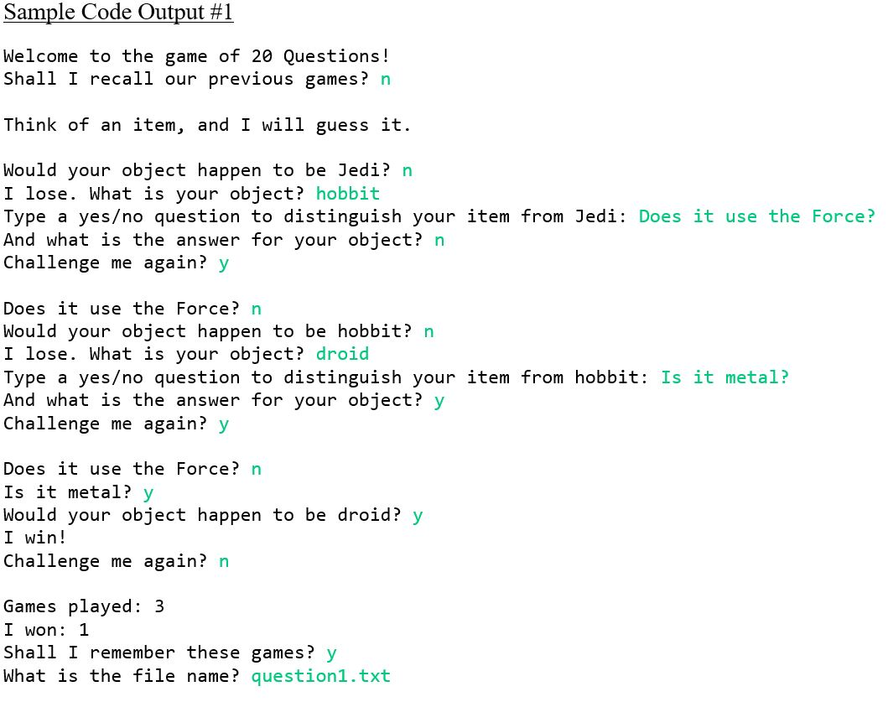
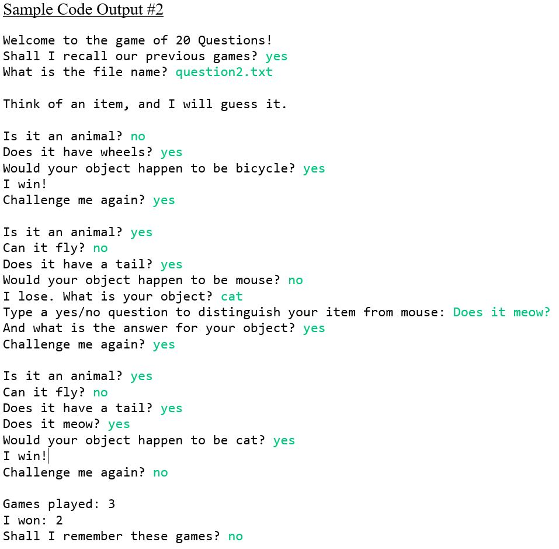

---
layout: post
title:  "20 Questions Assignment"
date:   2018-11-20 10:51:47 +0530
technologies:  Java, Binary Tree, Recursion, Eclipse
github: https://github.com/catai9/20-questions-assignment
img: 20-questions.JPG
--- 

Implementation of a "20 Questions" yes/no guessing game between a user and a computer.

The computer increases in intelligence with each losing game as the player is required to supply a new question to the computer that will assist in the differentiation between the object that the computer guessed and what the user is thinking.

The program uses test files as storage and implementation with recursion rather than loops as required by the assignment condition. 

Link to [Github Code]({{page.github}}).

Technologies used include {{page.technologies}}. 

## Application Functionality
1. Users can begin a new game that initially asks "Would your object happen to be Jedi?" and then train the computer onwards with their own questions and answers. The user can then store the game data in a new file to replay later on. A sample game is shown below.

  

2. Users can continue a previous game by providing the file name. The program also keeps track of the games that are played and the number of games that the user won. The user can decide not to store the current game as well. A sample interaction is shown below. 

  

