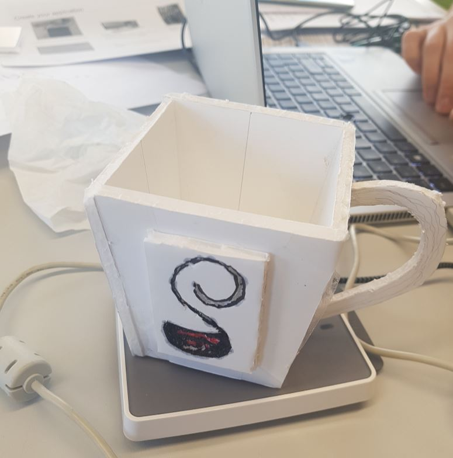
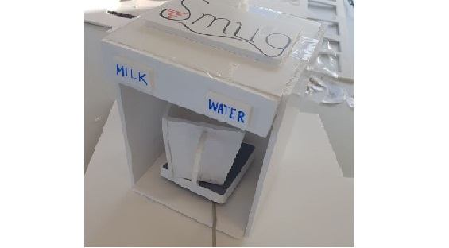
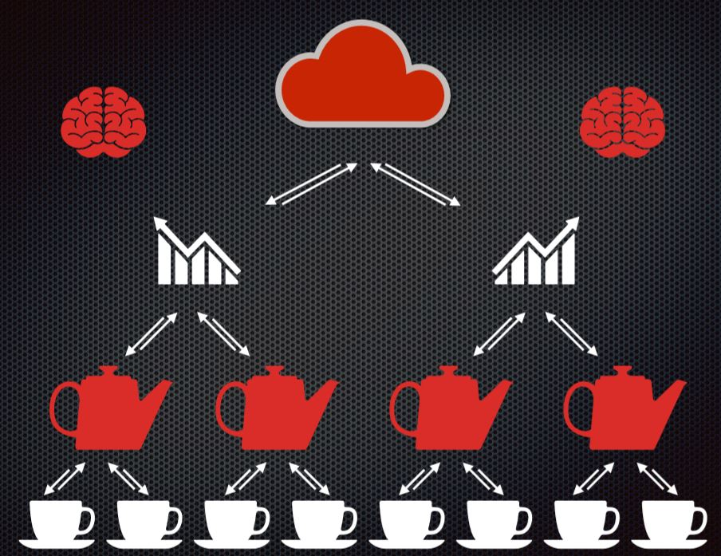

---
layout: post
title:  "Smart Mug Competition"
date:   2019-02-15 10:51:47 +0530
technologies:  Smart Technology, Antenna, Arduino board, Python
img: smug.JPG
--- 

Awarded first place in a Smart Object Competition judged by Infineon senior executives.

Developed a smart object using a created antenna, an Arduino board, and Python which stored user beverage preferences in a smart card in less than 6 hours with a team of international students.

The created smart object is SMUG and it is composed of a smart chip in a coffee mug that uses an IoT system.

Technologies used include {{page.technologies}}. 

Please note that there is no link to the code as this was developed using Infineon company laptops and the code is not allowed to be accessible to the general public.

## Application Description
The team decided to create a smart mug as members were concerned about the unhealthy overconsumption of coffee by people worldwide. Coffee overconsumption can lead to digestion problems, sleeping depreviation, decreased productivity, and many other negative side effects. However, benefits of controlling caffeine consumption include a healthier workplace and increased employee productivity.

### 1. The Mug
The mug is a prototype of a normal mug with a smart chip embedded in it. Real production is possible with 3D printing or gluing of the chip into a traditional mug.

  

### 2. The Brewing Machine
The machine contains a chip reader and produces a desired beverage based on the current time. It also deducts the price and logs data into the database.

  

### 3. The Software
The software has a two levels of authorization: management and employee. 

On the Management Level Authorization, users can input employee data into the database and set a global limit (ex. 4 cups of coffee per day). 

On the Employee Level Authorization, users can add money and set a schedule for their caffeine preferences during various times of the day.

  

